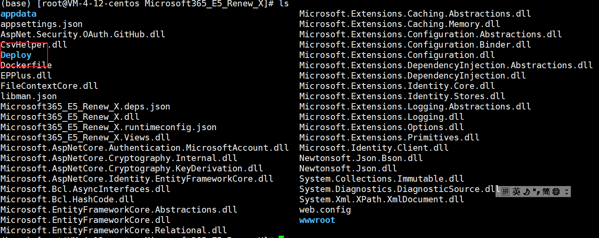
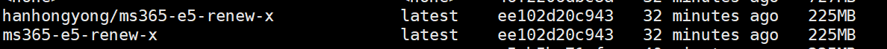

**制作不易，欢迎Star!!!**

本文是基于作者SundayRX提出的E5 调用API续订服务：Microsoft 365 E5 Renew X的基础上提出的Docker版本的E5调用API续订服务。

基础的账号注册等过程见SundayRX的博客：https://blog.csdn.net/qq_33212020/article/details/119747634

**本文主要是让小白轻松部署自己的E5续订服务。**

**优点：**

- 镜像小，仅仅225M，可以轻松部署在任何配置的服务器上，占用资源小
- 部署方便，仅仅使用一行命令即可完成部署。
- 等等。

**你需要有：**

- 有Docker的环境，了解Docker的基本命令（没有也没有关系，可以很快学会）。
- 有一个服务器/群晖NAS等。


**一些Docker环境安装的教程：**

- Docker环境搭建：https://www.jianshu.com/p/996e08b7976d
- 史上最全Docker环境安装指南：https://zhuanlan.zhihu.com/p/82269806

**为了使得容器更加稳定且好用（小白专用），latest版本中添加了vim等软件，并且更换了基础镜像，会有点大。如果介意，请使用slim版本**
  ```
   docker pull hanhongyong/ms365-e5-renew-x:slim
   ```
   下面部署命令时版本也改为slim版本即可。slim版本仅为225M。


**部署步骤**

1. 上传项目到服务器，只上传Deploy文件夹也可。

   

2. 安装Docker环境后，下载MS365 E5 Renew X镜像。

   

   ```
   docker pull hanhongyong/ms365-e5-renew-x
   ```

3. 进入MS365 E5 Renew X文件夹下，运行MS365 E5 Renew X镜像，得到容器。

   简单版（如果是新手，部署只是为了自己使用就运行下面这个命令就行了，不用管下面的定制版，然后进入容器，Deploy的Config.xml进行修改密码即可。）：

   ```
   docker run -d -p 1066:1066  hanhongyong/ms365-e5-renew-x:latest
   ```

   默认管理员密码为：123456

   定制版（定制版为高级操作，主要是为了高级用户分享自己的站点给别人、方便迁移等操作。小白无需使用。）：

   ```
   docker run -d -p 1066:1066 -v /root/Docker_Microsoft365_E5_Renew_X/Microsoft365_E5_Renew_X/Deploy:/app/Deploy  hanhongyong/ms365-e5-renew-x:latest
   ```
    其中-p为暴露服务器的端口（前面的1066，可以自行修改）和暴露容器的端口（后面的1066，可以自行修改，这个端口是在Config.xml中指定的开放的端口）；-v为数据卷的挂载，前面的Deploy指的是服务器中的Deploy文件夹（可以修改，但是必须是绝对路径），/app/Deploy指的是容器内的文件夹（不能修改）；--name为容器的名字。
   备份和迁移：
  所有的配置文件都放在/app文件路径下，如果您以后有迁移的需要可以用命令将容器中/app路径下的文件复制出来。或者在一开始的时候就可以挂载数据卷到您的之前的全部文件中。如：
  ```
docker run -d -p 1066:1066 -v /root/Docker_Microsoft365_E5_Renew_X/Microsoft365_E5_Renew_X/:/app/ hanhongyong/ms365-e5-renew-x:latest
  ```
  如此便可以实现您所要求的配置文件备份的功能，且您的容器中的文件和服务器主机中文件是一样的。

  

4. 服务访问：输入ip:1066.


**ARM64版本镜像**
   ```
   docker pull hanhongyong/ms365-e5-renew-x:arm
   ```
   
**Serverless部署**

Serverless部署:感谢[gd1214b](https://github.com/hongyonghan/Docker_Microsoft365_E5_Renew_X/issues/5)提出的解决方案。
具体见文件: [ReadMe_Serverless.md](./ReadMe_Serverless.md) 

**开发相关的命令（与部署无关）：**

```
##构建镜像
docker build -t ms365-e5-renew-x .
docker tag ms365-e5-renew-x:latest hanhongyong/ms365-e5-renew-x:latest

#上传镜像
docker push hanhongyong/ms365-e5-renew-x:latest
#登录dockerhub
docker login
#使用buildx编译arm架构的镜像
docker buildx build --push --tag hanhongyong/ms365-e5-renew-x:arm --platform linux/arm64/v8 -f Dockerfile_arm .
```

**制作不易，欢迎Star!!!**

GitHub:https://github.com/hongyonghan/Docker_Microsoft365_E5_Renew_X

Dockerhub:https://hub.docker.com/r/hanhongyong/ms365-e5-renew-x

CSDN:https://blog.csdn.net/qq_40605167/article/details/122888580


