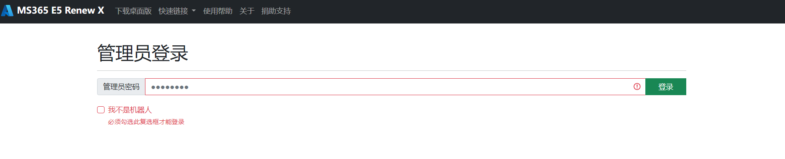

**制作不易，欢迎Star!!!**  

本文是基于作者SundayRX提出的E5 调用API续订服务：Microsoft 365 E5 Renew X的基础上提出的Docker版本的E5调用API续订服务。

基础的账号注册等过程见SundayRX的博客：https://blog.csdn.net/qq_33212020/article/details/119747634


**本项目主要为学习Dockerfile和Docker的部署使用，禁止将此项目进行商业化，仅推荐学习使用。**

**20230430更新，收到反馈，已经有部分同学的账号被强制关停。如果你是刚准备学习这个项目，我不推荐部署了（羊毛薅秃了）。如果你已经部署了，建议做好资料备份工作，随时准备下车！！！**

** 交流群 ** 
https://t.me/ms365e5

**优点：**

- 镜像小，仅仅225M，可以轻松部署在任何配置的服务器上，占用资源小
- 部署方便，仅仅使用一行命令即可完成部署。
- 可以邮件通知。
- 等等。

**你需要有：**

- 有Docker的环境，了解Docker的基本命令（没有也没有关系，可以很快学会）。
- 有一个服务器/群晖NAS等。


 <details>
<summary><h3> 一些Docker环境安装的教程</h3></summary>

   - Docker环境搭建：https://www.jianshu.com/p/996e08b7976d
   
   - 史上最全Docker环境安装指南：https://zhuanlan.zhihu.com/p/82269806
 </details>

<details>

<summary><h3> 部署步骤</h3></summary>

1. 运行MS365 E5 Renew X镜像，得到容器。


   ```
   docker run -d -p 1066:1066 -e TZ=Asia/Shanghai -e sender="by123@163.com" -e pwd="UNxxxxxxxxN" -e receiver="4dddqqq9dd6@qq.com"  -e adminpwd="123456" hanhongyong/ms365-e5-renew-x:pubemail
   ```

   修改-e后面的内容，其中 sender = '123456@163.com'为发送邮件的邮箱。
      receiver = '789456@qq.com'为接收邮件的邮箱。其中pwd为发送邮箱的授权码。授权码获取方式为，进入网页版163邮箱，点击设置，点击POP3/SMTP/IMAP，点击授权密码管理，新增授权码即可。
      adminpwd为web界面的登录密码。
   
2. 服务访问：输入ip:1066.



</details>

<details>
<summary><h3>Email通知功能(推荐,20230402更新。)</h3></summary>

   - email通知版本主要实现了检测部署的账号是否全部都正常运行。该版本会每天定时发送邮件来通知是否账号全部运行。
   
   - 该版本内测使用了一个月，目前没发现什么太大的问题。
   
   - 关于修改通知邮箱。推荐使用163邮箱。修改-e后面的内容，其中 sender = '123456@163.com'为发送邮件的邮箱。
      receiver = '789456@qq.com'为接收邮件的邮箱。其中pwd为发送邮箱的授权码。授权码获取方式为，进入网页版163邮箱，点击设置，点击POP3/SMTP/IMAP，点击授权密码管理，新增授权码即可。
      adminpwd为web界面的登录密码。
   
   - 关于版本。已发布x86机器和arm64v8，其他版本需要可以发issue，会尽快补充。
   - 发送邮件的日志的位置:/opt/test.log
   - 发送邮件的时间为每天18点。可以通过crontab命令修改。
   
   - x86版本：

    
    docker run -d -p 1066:1066 -e TZ=Asia/Shanghai -e sender="by123@163.com" -e pwd="UNxxxxxxxxN" -e receiver="4dddqqq9dd6@qq.com"  -e adminpwd="123456" hanhongyong/ms365-e5-renew-x:pubemail
    
   - arm64v8版本：

    
    docker run -d -p 1066:1066 -e TZ=Asia/Shanghai -e sender="byxxx@163.com" -e pwd="UxxxxWWN" -e receiver="41xxxxx@qq.com" -e adminpwd="123456" hanhongyong/ms365-e5-renew-x:arm64v8
    

 </details>

 <details>
<summary><h3> 监控网站运行（推荐部署）</h3></summary>
   [见文档](https://github.com/hongyonghan/Docker_Microsoft365_E5_Renew_X/blob/main/monitoring_service.md/)
 </details>


<details>
<summary><h3> 定制版（高级操作，主要是为了高级用户分享自己的站点给别人等操作。小白无需使用。）</h3></summary>

   ```
   docker run -d -p 1066:1066 -v /root/Docker_Microsoft365_E5_Renew_X/Microsoft365_E5_Renew_X/Deploy:/app/Deploy  hanhongyong/ms365-e5-renew-x:latest
   ```

  其中-p为暴露服务器的端口（前面的1066，可以自行修改）和暴露容器的端口（后面的1066，可以自行修改，这个端口是在Config.xml中指定的开放的端口）；-v为数据卷的挂载，前面的Deploy指的是服务器中的Deploy文件夹（可以修改，但是必须是绝对路径），/app/Deploy指的是容器内的文件夹（不能修改）；--name为容器的名字。
 </details>


<details>
<summary> <h3>备份和迁移：</h3></summary>
 

  所有的配置文件都放在/app文件路径下，如果您以后有迁移的需要可以用命令将容器中/app路径下的文件复制出来。或者在一开始的时候就可以挂载数据卷到您的之前的全部文件中。如：
  ```
docker run -d -p 1066:1066 -v /root/Docker_Microsoft365_E5_Renew_X/Microsoft365_E5_Renew_X/:/app/ hanhongyong/ms365-e5-renew-x:latest
  ```
  如此便可以实现您所要求的配置文件备份的功能，且您的容器中的文件和服务器主机中文件是一样的。

  </details>
 <details>
<summary><h3> 轻量化镜像版本</h3></summary>

 **为了使得容器更加稳定且好用（小白专用），latest版本中添加了vim等软件，并且更换了基础镜像，会有点大。如果介意，请使用slim版本**
   ```
   docker pull hanhongyong/ms365-e5-renew-x:slim
   ```
   下面部署命令时版本也改为slim版本即可。slim版本仅为225M。
   建议使用latest版本，这个版本持续修改完善下去，slim版本仅为资源受限的主机使用。

 </details>

<details>
<summary><h3>ARM64版本镜像</h3></summary>

   ```
   docker pull hanhongyong/ms365-e5-renew-x:arm
   ```
   ```
   docker run -d -p 1066:1066 -e TZ=Asia/Shanghai --name ms365  hanhongyong/ms365-e5-renew-x:arm
   ```
   这个版本是基础版本，没有邮件通知等功能。如果需要邮件通知功能。
 </details>

<details>
<summary><h3>Serverless部署</h3></summary>

没有服务器的同学们，可以使用koyeb进行部署。点击下面按钮一键部署:
> [](https://app.koyeb.com/deploy?type=docker&image=docker.io/hanhongyong/ms365-e5-renew-x&name=web-renew&ports=1066;http;/)

koyeb部署:感谢[gd1214b](https://github.com/hongyonghan/Docker_Microsoft365_E5_Renew_X/issues/5)提出的解决方案。
具体见文件: [ReadMe_Serverless.md](./ReadMe_Serverless.md) 

注意：类似于heroku和koyeb等云容器平台，都会有重启实例的现象，不过heroku是每天强制重启，koyeb是隔几天重启一次。每次重启都会丢失实例在部署后的所有更改，造成数据丢失。请大家注意。感谢[ChirmyRam](https://github.com/hongyonghan/Docker_Microsoft365_E5_Renew_X/issues/15)给出的提醒。

</details>

<details>
<summary><h3>开发相关的命令（与部署无关）</h3></summary>


```
##构建镜像
docker build -t ms365-e5-renew-x .
docker tag ms365-e5-renew-x:latest hanhongyong/ms365-e5-renew-x:latest

#上传镜像
docker push hanhongyong/ms365-e5-renew-x:latest
#登录dockerhub
docker login
#使用buildx编译arm架构的镜像
docker buildx build --push --tag hanhongyong/ms365-e5-renew-x:arm --platform linux/arm64/v8 -f Dockerfile_arm .
```

</details>

### 赞助我

项目会持续更新，大家有啥问题可以发issue。如果可以的话，欢迎大家赞助一元钱。


### Starchart


**制作不易，欢迎Star!!!**

GitHub:https://github.com/hongyonghan/Docker_Microsoft365_E5_Renew_X

Dockerhub:https://hub.docker.com/r/hanhongyong/ms365-e5-renew-x

CSDN:https://blog.csdn.net/qq_40605167/article/details/122888580


